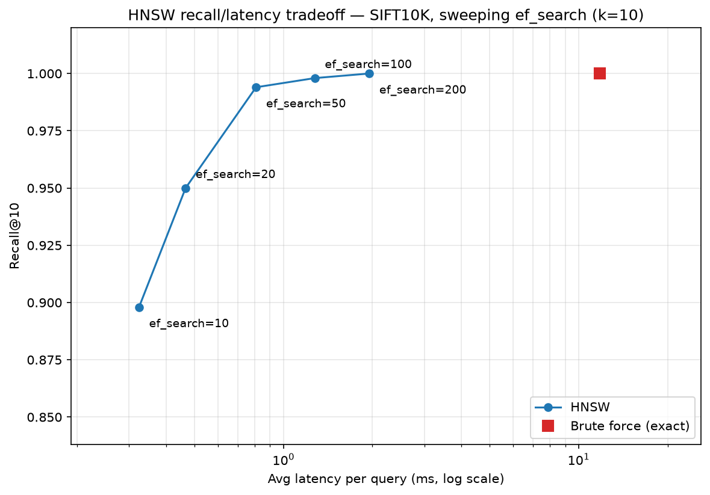
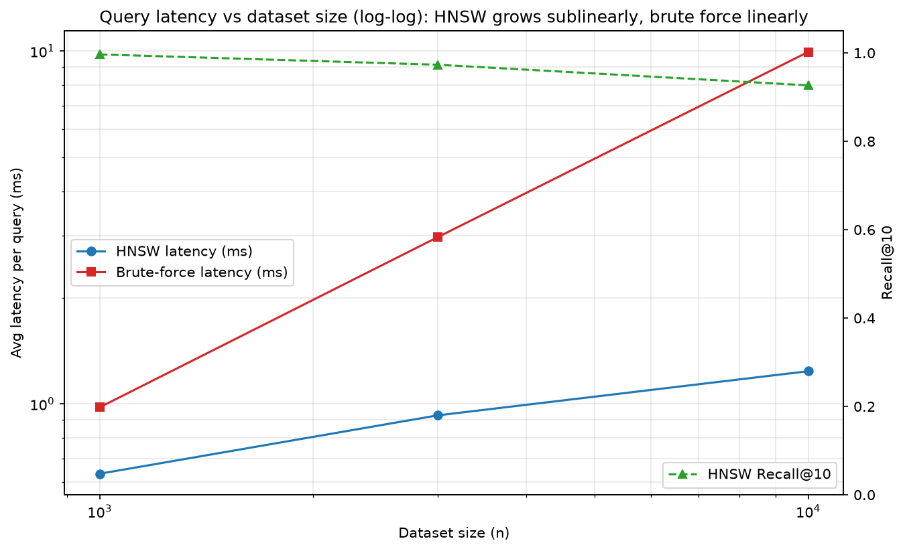

# Vector Search Engine

HNSW (Hierarchical Navigable Small World) approximate nearest-neighbor search implemented from scratch in NumPy, benchmarked against a brute-force baseline on SIFT image descriptors. Based on [Malkov & Yashunin (2016)](https://arxiv.org/abs/1603.09320).

## Results

10,000 128-dimensional SIFT descriptors:

**99.4% recall@10 at 0.81 ms/query — 14.6x faster than exact search (11.81 ms).**


| `ef_search` | Recall@10 | Latency/query | Speedup   |
| ----------- | --------- | ------------- | --------- |
| 10          | 89.8%     | 0.32 ms       | 36.4x     |
| 20          | 95.0%     | 0.47 ms       | 25.3x     |
| **50**      | **99.4%** | **0.81 ms**   | **14.6x** |
| 100         | 99.8%     | 1.28 ms       | 9.3x      |
| 200         | 100.0%    | 1.95 ms       | 6.0x      |
| brute force | 100.0%    | 11.81 ms      | 1.0x      |




### Scaling


| n      | HNSW    | Brute force | Speedup |
| ------ | ------- | ----------- | ------- |
| 1,000  | 0.63 ms | 0.98 ms     | 1.6x    |
| 3,000  | 0.93 ms | 2.97 ms     | 3.2x    |
| 10,000 | 1.24 ms | 9.94 ms     | 8.0x    |




## Quickstart

```bash
pip install -r requirements.txt
python -m scripts.benchmark
```

The SIFT10K corpus (~5 MB) downloads automatically on first run and caches under `data/cache/`. If the FTP source is blocked, download [siftsmall.tar.gz](ftp://ftp.irisa.fr/local/texmex/corpus/siftsmall.tar.gz) manually and extract `siftsmall_base.fvecs` and `siftsmall_query.fvecs` into `data/cache/small/`.

## How it works

- **Layered graph structure**: each node's max layer is drawn from an exponential distribution (`floor(-ln(U) / ln(M))`), so ~1/M of nodes exist on each layer above. Layer 0 holds all vectors; upper layers are sparse with long edges for coarse navigation.
- **Search**: greedy single-step descent (`ef=1`) through upper layers to find an entry point, then beam search (width `ef_search`) at layer 0 for the final top-`k` results.
- **Insertion**: connects new nodes to `M` neighbors per layer (`2M` at layer 0), pruning any neighbor list that exceeds capacity.


## Known simplifications

- Neighbor selection uses "M closest" rather than the diversity-preserving heuristic. This makes larger `M` values (e.g. 32) perform worse than `M=16`, since long-range shortcuts get crowded out.
- Pruning is one-directional: an overflowing node drops edges, but the other endpoint's list is untouched.
- Distances are computed one pair at a time in pure Python, so absolute latency isn't production-grade — but comparisons to brute force are apples-to-apples.


## Notes

- `M` has far more effect on recall than `ef_construction`. `M=8` is too sparse for 128-D data (recall varies 37–86% across seeds); `M=16` reaches ~95% mean with a tight spread. Increasing `ef_construction` from 100 to 200 had no measurable effect.
- Layer-descent entry points must come from the current layer's candidate set, not the newly inserted node (which has no edges yet) — getting this wrong silently fragments the graph.
- Ground truth must be computed by brute force over the same vector set used to build the index, or recall numbers will be meaningless.


## Layout


| Path                       | Contents                                       |
| -------------------------- | ---------------------------------------------- |
| `baseline/distance.py`     | Euclidean and cosine distance                  |
| `baseline/bruteforce.py`   | Exact O(n) index — correctness oracle          |
| `data/generate_vectors.py` | SIFT download, cache, `.fvecs` parsing         |
| `data/ground_truth.py`     | Exact neighbors, cached as JSON                |
| `hnsw/nsw.py`              | Single-layer NSW graph                         |
| `hnsw/hnsw.py`             | `HNSWIndex` — layer assignment, insert, search |
| `eval/recall.py`           | `recall_at_k`, `mean_recall_at_k`              |
| `eval/benchmark.py`        | Latency measurement, sweeps, charts            |
| `app.py`                   | Reproduces all results above                   |


